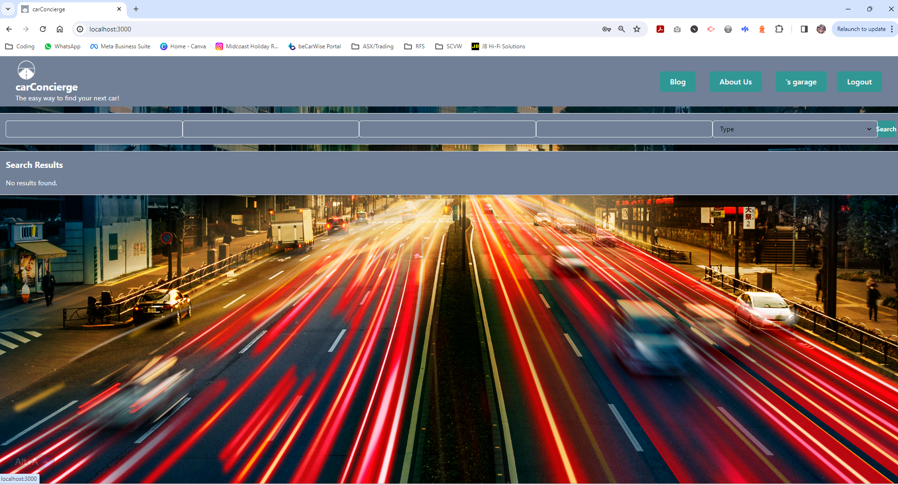

# P3 - carConcierge

  ## Description
  The aim of this project was to use build a single page MERN application to solve a real world problem. 
  I chose to build a car research tool to help people who are not interested in cars and want to avoid the hard sell.
  In addition to the car search engine, I also incorporated a blog page that will be managed by admin to provide bias free car news. There is also comment functionality for logged in users.
  I also want to add a garage feature for the User to save favourite cars, blogs as well as their own vehicle information for quick reference.
  
  ## Table of Contents
  * [Description](#description)
  * [Installation](#installation)
  * [Usage](#usage)
  * [Licenses](#licenses)
  * [Contributing](#how-to-contribute)
  * [Tests](#tests)
  * [Questions/Contact Info](#questionscontacts)
  * [Credits](#credits)

  ## Installation
  There is no installation required to run this app, you can simply click the link to see the deployed site. 
  If you would like to use the code locally, use the below steps...
  1. Clone the code from this repository
  2. Open the project in VS Code (or similar)
  3. Install npm dependancies
  4. Run the application from the terminal

  ## Usage
  Screenshot, GIF + deployed app link is below...
  
 ### Link deployed application (https://carconcierge.onrender.com) 
 ### Link to presentation (https://docs.google.com/presentation/d/1fbGzdXFM7Zf6M8U8G8L8YdWAmV50nGcwsF3ck7ZUIOs/edit?usp=sharing)

  ## Licenses
  This project is covered under the MIT license.
  To learn more about what this means, click the license button at the top.

  ## How to contribute
  Contact me via the details below.

  ## Tests
  N/A

  ## Questions/Contacts
  Have questions about this project?  
  GitHub: https://github.com/Petarlo 
  Email: petaswan986@gmail.com  

  ## Credits
  N/A
